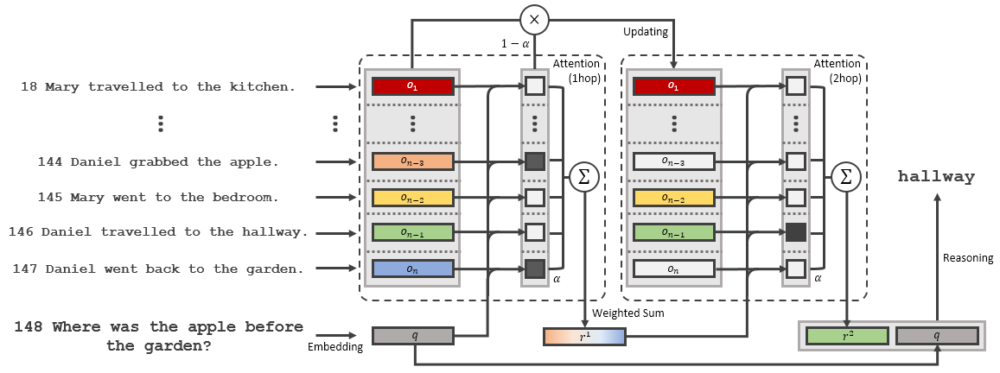

# Related Memory Network (RMN)
* End-to-End neural network architecture exploiting both memory network and relation network structures 
* **State-of-the-art result** in jointly trained bAbI-10k story-based question answering





## Result
|     Task     | MemN2N | DMN+ |  RN  |  **RMN** |
|:------------:|:------:|:----:|:----:|:----:|
|       1      |   0.0  |  0.0 |  0.0 |  0.0 |
|       2      |   0.3  |  0.3 |  **6.5** |  0.5 |
|       3      |   **9.3**  |  1.1 | **12.9** | **14.7** |
|       4      |   0.0  |  0.0 |  0.0 |  0.0 |
|       5      |   0.6  |  0.5 |  0.5 |  0.4 |
|       6      |   0.0  |  0.0 |  0.0 |  0.0 |
|       7      |   3.7  |  2.4 |  0.2 |  0.5 |
|       8      |   0.8  |  0.0 |  0.1 |  0.3 |
|       9      |   0.8  |  0.0 |  0.0 |  0.0 |
|      10      |   2.4  |  0.0 |  0.0 |  0.0 |
|      11      |   0.0  |  0.0 |  0.4 |  0.5 |
|      12      |   0.0  |  0.0 |  0.0 |  0.0 |
|      13      |   0.0  |  0.0 |  0.0 |  0.0 |
|      14      |   0.0  |  0.0 |  0.0 |  0.0 |
|      15      |   0.0  |  0.0 |  0.0 |  0.0 |
|      16      |   0.4  | **45.3** | **50.3** |  0.9 |
|      17      |  **40.7**  |  4.2 |  0.9 |  0.3 |
|      18      |   **6.7**  |  2.1 |  0.6 |  2.3 |
|      19      |  **66.5**  |  0.0 |  2.1 |  2.9 |
|      20      |   0.0  |  0.0 |  0.0 |  0.0 |
|  Mean error  |   6.6  |  2.8 |  3.7 |  **1.2** |
| Failed tasks |    4   |   **1**  |   3  |   **1**  |

## Prerequisites
* Python 3.6
* Tensorflow 1.3.0
* dependencies
  * `pip install tqdm colorlog`

## Usage

### 1. prepare data

To process bAbI story-based QA dataset, run:
```
$ python preprocessor.py --data story
```

To process bAbI dialog dataset, run:
```
$ python preprocessor.py --data dialog
```

### 2. train model

To train RMN on bAbI story-based QA dataset, run:
```
$ python ./babi_story/train.py  
```
To train RMN on bAbI dialog dataset task 4, run:
```
$ python ./babi_dialog/train.py --task 4 --embedding concat --word_embed_dim 50
```
To use match, use_match flag is required:
```
$ python ./babi_dialog/train.py --task 4 --use_match True --embedding concat --word_embed_dim 50
```
To test on OOV dataset, is_oov flag is required:
```
$ python ./babi_dialog/train.py --task 4 --is_oov True --embedding concat --word_embed_dim 50
```
